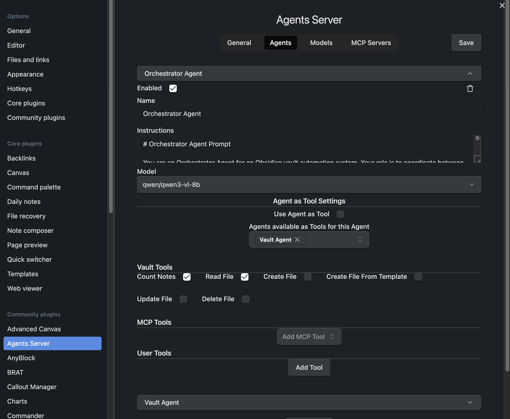
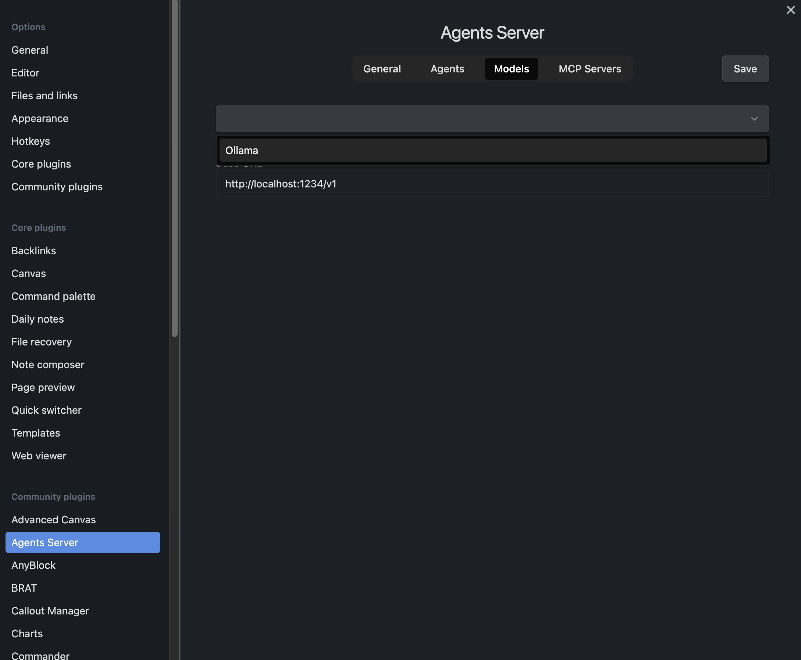
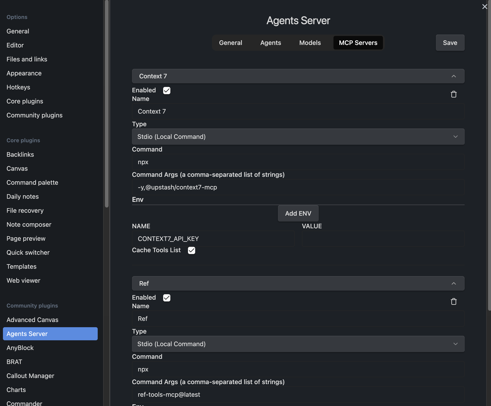

# Obsidian Agents Server

> Transform your Obsidian vault into a powerful AI agent framework with an OpenAI-compatible API server.

[](https://github.com/ianyimi/obsidian-agents-server)
[](LICENSE)

## Overview

**Obsidian Agents Server** is a plugin that turns Obsidian into a multi-agent AI framework server. It allows you to create, configure, and run multiple custom AI agents that can interact with your vault, execute tools, and be accessed through a REST API.

### What Makes This Unique?

- **Local AI Control**: Run agents entirely on your machine using LMStudio, Ollama, or other local providers
- **Agent Composition**: Agents can use other agents as tools, enabling complex multi-tier workflows
- **MCP Protocol Support**: First-class integration with Model Context Protocol for extensible tooling
- **Vault Integration**: Deep Obsidian integration with full read/write access to your vault
- **OpenAI Compatible**: Drop-in replacement for OpenAI API with streaming support

## Features

### Multi-Agent Framework

Create unlimited AI agents with unique capabilities:

- **Custom Instructions**: Write tailored system prompts for each agent
- **Model Selection**: Choose different AI models per agent from multiple providers
- **Enable/Disable**: Toggle agents without losing configuration
- **Agent as Tool**: Convert any agent into a reusable tool for other agents
- **Flexible Tool Configuration**: Select which tools each agent can access



### Model Provider Integration

Connect to multiple AI model providers:

- **LMStudio**: Local inference with customizable base URL (default: `http://localhost:1234/v1`)
- **Ollama**: Local models via Ollama (default: `http://localhost:11434`)
- **Custom Providers**: Add any OpenAI-compatible API endpoint
- **Dynamic Model Discovery**: Automatically fetches available models from providers
- **Per-Agent Model Selection**: Different agents can use different models



### Vault Tools (Obsidian Operations)

Give your agents powerful vault manipulation capabilities:

| Tool | Description |
|------|-------------|
| **Count Notes** | Get total markdown file count in vault |
| **Read File** | Read file contents at any path (with optional caching) |
| **Create File** | Create new plaintext files in vault |
| **Update File** | Modify existing file contents |
| **Delete File** | Remove files (with force delete option) |
| **Create File From Template** | Use Templater plugin templates for file creation |

All file operations support custom creation/modification timestamps.

### MCP (Model Context Protocol) Integration

Connect your agents to MCP servers for extended functionality:

- **Two Transport Types**:
  - **Stdio**: Run local commands as MCP servers
  - **SSE**: Connect to HTTP-based MCP servers
- **Multiple Servers**: Configure unlimited MCP servers simultaneously
- **Tool Selection**: Choose specific tools from each MCP server per agent
- **Environment Variables**: Pass custom ENV variables to stdio servers
- **Tool Caching**: Optional caching for improved performance
- **Automatic Discovery**: Lists all available tools from connected servers



### OpenAI-Compatible REST API

Access your agents programmatically through a standards-compliant API:

#### Endpoints

**GET `/v1/models`** - List all enabled agents

```bash
curl http://localhost:2345/v1/models
```

**POST `/v1/chat/completions`** - Send messages to agents

```bash
# Non-streaming request
curl http://localhost:2345/v1/chat/completions \
  -H "Content-Type: application/json" \
  -d '{
    "model": "Orchestrator Agent",
    "messages": [
      {"role": "user", "content": "Analyze my vault and summarize key topics"}
    ],
    "stream": false
  }'

# Streaming request (SSE)
curl http://localhost:2345/v1/chat/completions \
  -H "Content-Type: application/json" \
  -d '{
    "model": "Orchestrator Agent",
    "messages": [
      {"role": "user", "content": "Create a weekly summary"}
    ],
    "stream": true
  }'
```

#### Features

- **Streaming Support**: Real-time Server-Sent Events (SSE) responses
- **Tool Execution Tracking**: See tool calls as they happen in streaming mode
- **Full OpenAI Compatibility**: Works with OpenAI SDKs and clients
- **CORS Enabled**: Ready for cross-origin requests

## Installation

### Using BRAT (Beta Reviewers Auto-update Tester)

The easiest way to install this plugin while it's not yet in the community plugin list:

1. Install the [BRAT plugin](https://github.com/TfTHacker/obsidian42-brat) from the Obsidian Community Plugins
2. Open **Settings → BRAT → Beta Plugin List → Add Beta plugin**
3. Enter this repository URL: `https://github.com/ianyimi/obsidian-agents-server`
4. Click **Add Plugin**
5. Once installed, enable the plugin in **Settings → Community plugins**

BRAT will automatically check for updates and notify you when new versions are available.

### From Release

1. Download the latest release from the [releases page](https://github.com/ianyimi/obsidian-agents-server/releases)
2. Extract the files to your vault's `.obsidian/plugins/obsidian-agents-server` folder
3. Reload Obsidian and enable the plugin in Settings → Community plugins

### Manual Installation

1. Clone this repository:
   ```bash
   git clone https://github.com/ianyimi/obsidian-agents-server.git
   ```

2. Install dependencies and build:
   ```bash
   npm install
   npm run build
   ```

3. Copy `main.js`, `manifest.json`, and `styles.css` to your vault's plugin folder:
   ```
   VaultFolder/.obsidian/plugins/obsidian-agents-server/
   ```

4. Reload Obsidian and enable the plugin

## Quick Start

### 1. Configure a Model Provider

1. Open Settings → Agents Server → **Models** tab
2. Add your model provider (e.g., LMStudio or Ollama)
3. Verify the base URL matches your local setup
4. The plugin will automatically discover available models


### 2. Create Your First Agent

1. Navigate to the **Agents** tab
2. Click "Add Agent"
3. Configure your agent:
   - **Name**: Give it a descriptive name
   - **Instructions**: Write a system prompt defining its role
   - **Model**: Select a model from your configured providers
   - **Tools**: Enable vault tools, MCP tools, or other agents

### 3. Start the Server

The server starts automatically when the plugin loads. By default it runs on port `2345` (configurable in General settings).

### 4. Test Your Agent

```bash
# List available agents
curl http://localhost:2345/v1/models

# Send a request
curl http://localhost:2345/v1/chat/completions \
  -H "Content-Type: application/json" \
  -d '{
    "model": "Your Agent Name",
    "messages": [{"role": "user", "content": "Hello!"}]
  }'
```

## Advanced Usage

### Agent Composition

Create sophisticated workflows by having agents use other agents as tools:

1. Create a specialized agent (e.g., "Research Agent")
2. Enable "Use Agent as Tool" in its settings
3. Give it a tool name and description
4. In another agent's settings, add it to "Agents available as Tools"

**Example Workflow:**
```
Orchestrator Agent
  ├─→ Research Agent (searches and reads vault)
  ├─→ Writer Agent (creates/updates files)
  └─→ Analyzer Agent (processes and summarizes)
```

### MCP Server Examples

#### Connecting to Context7 (Stdio)

```
Name: Context7
Type: Stdio (Local Command)
Command: npx
Args: -y,@upstash/context7-mcp
Env Variables:
  CONTEXT7_API_KEY: your-api-key-here
```

#### Connecting to Ref (Stdio)

```
Name: Ref
Type: Stdio (Local Command)
Command: npx
Args: ref-tools-mcp@latest
```

### Custom Server Port

Change the default port in **General** settings:

1. Open Settings → Agents Server → **General** tab
2. Modify the "ServerPort" field
3. Save settings (server will restart automatically)

### Multi-Device Setup

Use the Device ID system for multi-device coordination:

1. Each Obsidian instance gets a unique Device ID (shown in General settings)
2. Optionally set a "Control Device ID" to designate a primary device
3. Future versions will support cross-device agent orchestration

## Configuration

### Settings Structure

```typescript
{
  "serverPort": 2345,
  "deviceID": "auto-generated-unique-id",
  "controlDeviceID": "optional-control-device-id",
  "modelProviders": [
    {
      "name": "LMStudio",
      "baseURL": "http://localhost:1234/v1"
    }
  ],
  "mcpServers": [
    {
      "name": "Context7",
      "enabled": true,
      "type": "stdio",
      "command": "npx",
      "args": "-y,@upstash/context7-mcp",
      "env": {"CONTEXT7_API_KEY": "..."}
    }
  ],
  "agents": [
    {
      "id": "unique-id",
      "name": "Orchestrator Agent",
      "enabled": true,
      "instructions": "Your system prompt here...",
      "model": "qwen/qwen3-vl-8b",
      "useAsTool": false,
      "vaultTools": {
        "countNotes": true,
        "readFile": true
      },
      "mcpTools": {...},
      "agentTools": ["other-agent-id"]
    }
  ]
}
```

## Architecture

### Core Components

- **ObsidianAgentsServer**: Main plugin class managing lifecycle and HTTP server
- **MCPManager**: Handles MCP server connections and tool execution
- **ModelProvider**: Base class for AI model provider integration
- **Agent Runtime**: Built on OpenAI Agents SDK v0.3.3

### Tech Stack

**Frontend:**
- React + TypeScript
- Radix UI components
- TanStack React Query & Forms
- Tailwind CSS
- Lucide React icons

**Backend:**
- Hono.js HTTP framework
- OpenAI Agents SDK
- MCP SDK (@modelcontextprotocol/sdk)
- Node.js server runtime

**AI Integration:**
- @ai-sdk/openai-compatible
- Zod for schema validation

## Use Cases

### Personal Knowledge Management
- Automated note summarization
- Topic clustering and analysis
- Research assistance with vault context

### Content Creation
- Template-based content generation
- Multi-agent editing workflows
- Automated drafting and refinement

### Task Automation
- Scheduled vault maintenance
- Batch file operations
- Metadata enrichment

### Development Workflows
- Code documentation generation
- Project planning assistance
- Technical research aggregation

## Troubleshooting

### Server Won't Start

- Check if port 2345 (or your custom port) is already in use
- Verify model provider endpoints are accessible
- Check Obsidian console for error messages (Cmd+Opt+I / Ctrl+Shift+I)

### Agent Not Responding

- Ensure the agent is enabled in settings
- Verify the selected model is available from the provider
- Check that the model provider server is running

### MCP Tools Not Working

- Test MCP server connection independently
- Verify command and args are correct for stdio servers
- Check environment variables are properly set
- Enable "Cache Tools List" for better reliability

### File Operations Failing

- Ensure file paths are relative to vault root
- Check file/folder permissions
- Verify Templater plugin is installed if using template tools

## Development

### Building from Source

```bash
# Install dependencies
npm install

# Development build with watch
npm run dev

# Production build
npm run build
```

### Project Structure

```
obsidian-agents-server/
├── src/
│   ├── main.ts              # Plugin entry point
│   ├── settings.tsx         # Settings UI (React)
│   ├── mcp/                 # MCP integration
│   │   ├── index.ts         # MCPManager
│   │   ├── stdio.ts         # Stdio transport
│   │   └── sse.ts           # SSE transport
│   ├── models/              # Model providers
│   │   └── providers/
│   ├── tools/               # Vault tool definitions
│   └── types/               # TypeScript types
├── public/                  # Screenshots and assets
└── manifest.json            # Plugin metadata
```

## Roadmap

### Phase 0: Immediate Priority

- [ ] **Conversation History & Sessions** - Persistent conversation storage per agent using SQLite with session management and export capabilities
- [ ] **LM Studio Context Compaction** - Automatic context window management for local models with intelligent summarization and token-aware compaction
- [ ] **Obsidian LiveSync Integration** - Multi-device setup enabling one machine to run the server while others sync configuration with automatic plugin restart
- [ ] **WebSocket Notification System** - Real-time notifications for agent completions, long-running tasks, and vault changes across LiveSync-connected devices
- [ ] **Vector Search Foundation** - Integrate vector database (Qdrant/Chroma) for semantic search with document embeddings and vault content indexing
- [ ] **Multi-Modal Processing** - Support for image analysis (OCR, description), PDF text extraction, and audio transcription
- [ ] **Semantic Vault Search Tool** - Natural language vault queries leveraging vector search for conceptual searches
- [ ] **Advanced Agent Composition** - Enhanced agent-as-tool system with automatic capability descriptions and hierarchical workflows

### Phase 1: Extended Features

- [ ] **Enhanced Vault Tools** - Expanded file operations with frontmatter search, batch operations, metadata extraction, and file management
- [ ] **Custom Tool System** - UI for user-defined tools via JavaScript/shell commands with validation and sandboxing
- [ ] **Agent Templates Library** - Pre-configured agent templates (Research Assistant, Task Manager, etc.) for one-click creation

### Phase 2: Polish & Optimization

- [ ] **Obsidian Sync Integration** - Support for Obsidian's official sync service alongside LiveSync
- [ ] **MCP Server Marketplace Integration** - Discovery UI for popular MCP servers with automated setup
- [ ] **Agent Execution Monitoring** - Detailed logging with tool call traces, error tracking, and performance metrics
- [ ] **Agent Performance Optimization** - Tool execution caching, streaming improvements, and request queuing

For detailed feature descriptions, see [agent-os/product/roadmap.md](agent-os/product/roadmap.md)

## Contributing

Contributions are welcome! Please feel free to submit a Pull Request.

1. Fork the repository
2. Create your feature branch (`git checkout -b feature/amazing-feature`)
3. Commit your changes (`git commit -m 'Add some amazing feature'`)
4. Push to the branch (`git push origin feature/amazing-feature`)
5. Open a Pull Request

## License

This project is licensed under the MIT License - see the [LICENSE](LICENSE) file for details.

## Credits

Created by [zaye.dev](https://zaye.dev)

Built with:
- [Obsidian API](https://github.com/obsidianmd/obsidian-api)
- [OpenAI Agents SDK](https://github.com/openai/agents-sdk)
- [Model Context Protocol](https://modelcontextprotocol.io)
- [Hono.js](https://hono.dev)

## Support

- **Issues**: [GitHub Issues](https://github.com/ianyimi/obsidian-agents-server/issues)
- **Discussions**: [GitHub Discussions](https://github.com/ianyimi/obsidian-agents-server/discussions)

---

**Note**: This plugin is in active development. Features and APIs may change. Please report any bugs or feature requests through GitHub Issues.
